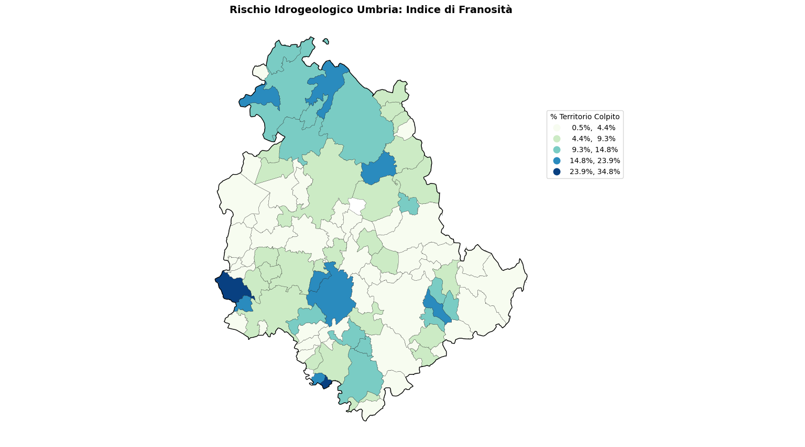
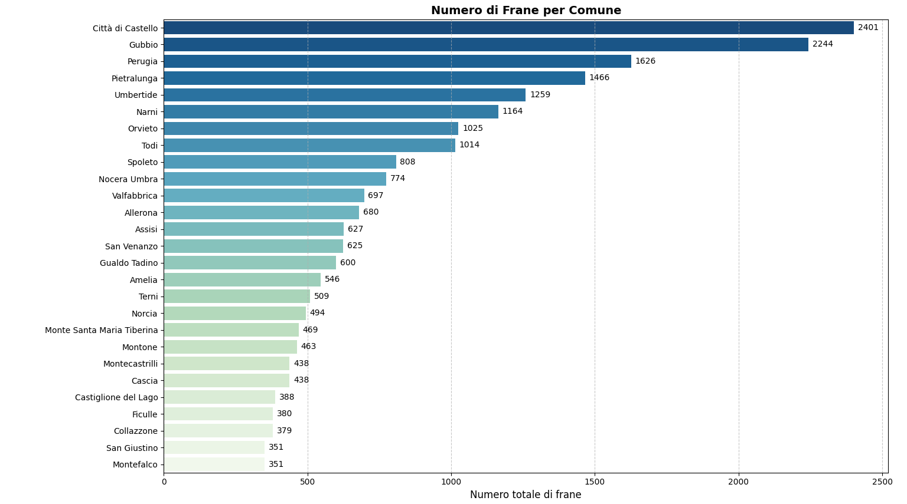
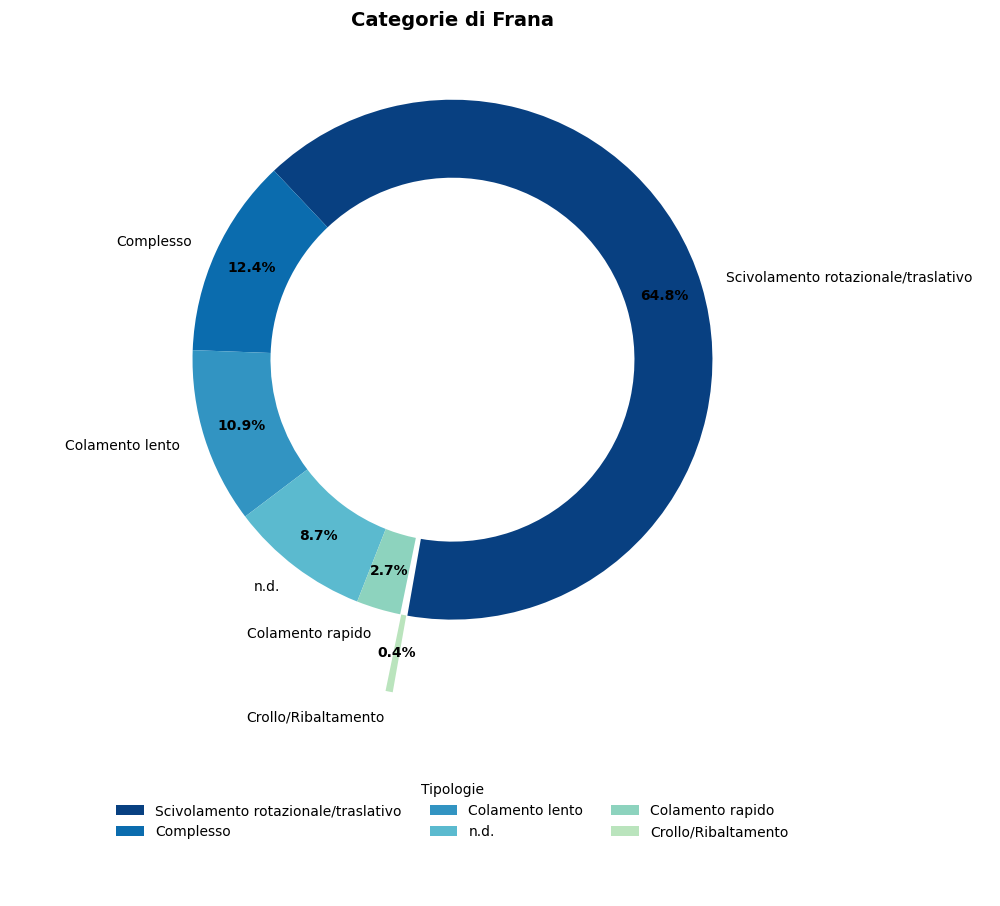

# geospatial-analysis-italy-umbria-landslide-risk
# Hydrogeological risk
In this notebook, we will calculate and analyze the landslide risk index using open data provided by the IFFI inventory for Umbria region (Italy).
**source: https://www.isprambiente.gov.it/it/progetti/cartella-progetti-in-corso/suolo-e-territorio-1/iffi-inventario-dei-fenomeni-franosi-in-italia**
The aim of the project is to demonstrate the flexibility and speed of Python in analyzing geospatial datasets compared to traditional GIS systems, as well as the ease of creating graphical representations for statistical maps.
**The project contains a folder named ‘data’ that holds the files used for the analysis.**

## Geospatial Output - Dashboard Finale
### Choropleth Map - Landslide Index

## Barplot - Landslides recorded by Municipality

## Donut Chart - Landslide Types count % 

